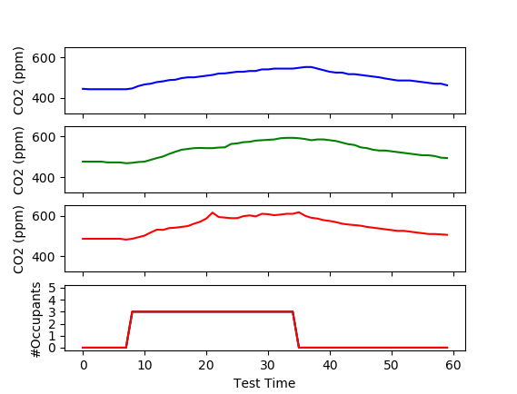

# CO2Occupancy

### Summary
This repository contains an experiment dataset for Wireless Sensor Network (WSN)-based room occupancy estimation. The tests included are from observation of control settings with known true occupancy levels. 
The included script provides basic functionality, loading the dataset into pandas dataframe format and plotting the data series against their corresponding occupancy labels (Tested w. Python 3.5.3).

The objective of this dataset is to facilitate the design and assessment of *learned* occupancy estimation models which perform without knowledge of the mass-balance parameters of the deployed environment.

### Acquisition
A wireless sensing prototype was constructed in order to observe the deployment environment and generate a data series to train occupancy estimation. The main sensing capability was provided by:
- [DHT22 Sensor](https://learn.adafruit.com/dht/overview)
- [K30 CO2 Sensor](https://www.co2meter.com/products/k-30-co2-sensor-module)

Temperature, Humidity, and CO2 concentration were each read at 0.33Hz. To address the noise in concentration readings, the median of this data was taken on a per-minute basis.

2-3 sensoring nodes were deployed in a conference room with dimensions: 5.8x5.35x2.8m^3. Data is partitioned by date of acqusition and all present sensor streams are grouped in the same directory.

## Reading the Data
### Naming Convention
The directories group the data from a given occupancy session for all co-located sensors. The directory names are in 'mm-dd-HHMM' format. The data from January 1st, starting at 3:51pm is thus given by:

`01-11-1551` 

The specific csv files contained within these directories share a similar naming convention with the addition of Sensor ID, end time, and its corresponding occupancy pattern. The expanded format is as follows:

`RES_mm-dd_<ID>_<START>_<END>_<Oc#>.csv`

### Data Files
The data itself is formatted under seven columns as shown below. 

+ The first is the data index.
+ *CO2* - The carbon dioxide reading in part-per-million (ppm)
+ *HeatIdx* - Humidity adjusted Temperature in Celsius (see DHT22 for method)
+ *Hum* - Relative Humidity in percent.
+ *Oc<ID>* - The true occupancy label in persons. Cell may include -1 where room should be vacant but was not directly observed.
+ *Temp* - Measured temperature in Celsius
+ *Time* - Date and Time, `yyyy-mm-dd HH:MM`

| | **CO2** | **HeatIdx** | **Hum** | **Oc<ID>** | **Temp** | **Time** |
| ----- | ----- | ----- | ----- | ----- | ----- | ----- |
| 0 | 550.78 | 19.98 | 31.4 | -1 | 21 | 2018-01-11 15:51 |
| | | | ... | | | |
| 83 | 722.66 | 19.91 | 33 | 0 | 20.9 | 2018-01-11 17:14 |
| 84 | 736.33 | 19.91 | 33 | 4 | 20.9 | 2018-01-11 17:15 |
